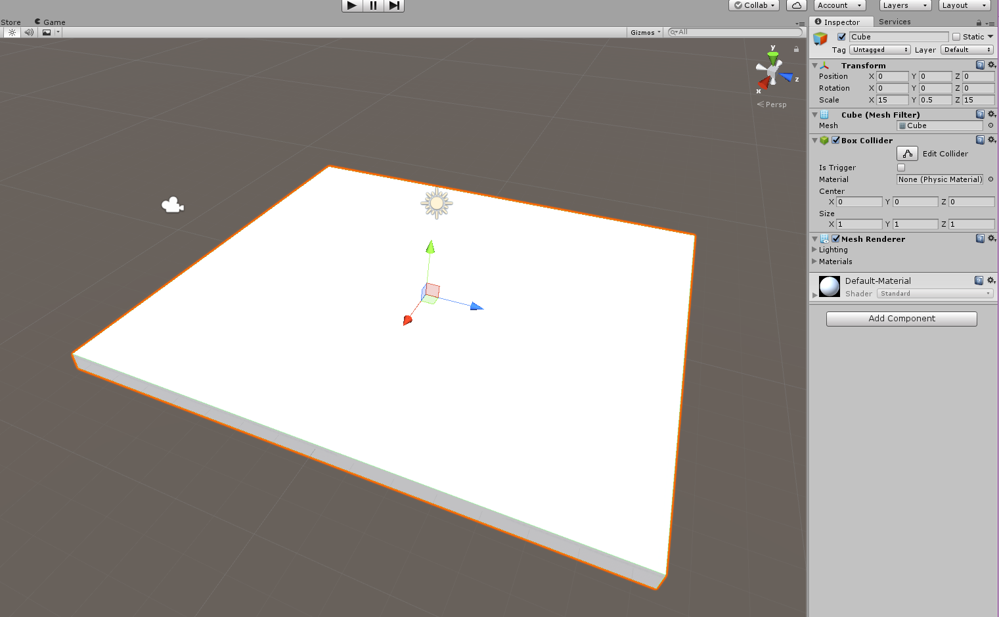
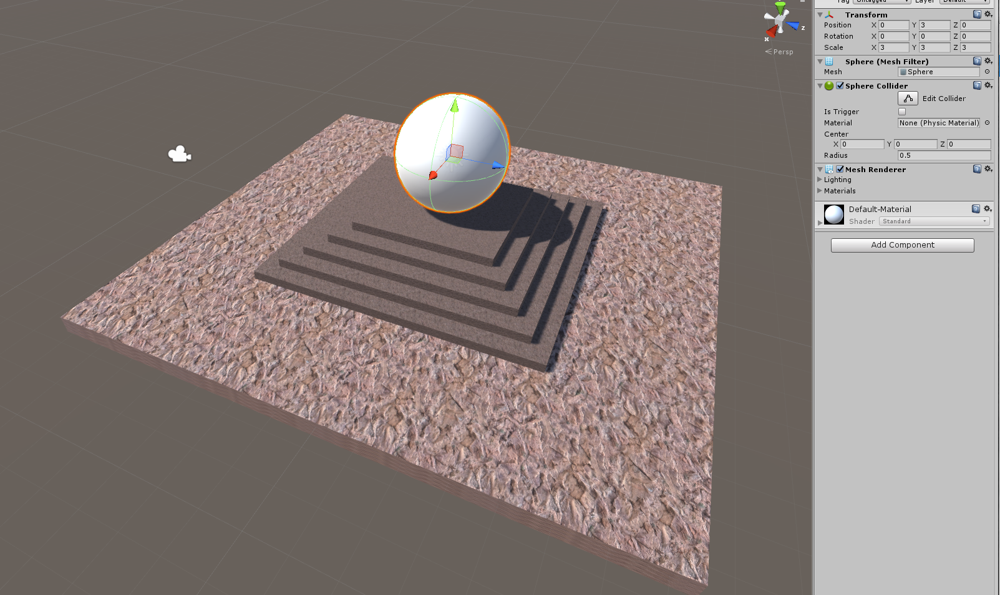

In this tutorial we will work together to create a realistic scene. This scene will teach us about Materials and how they work within Unity.

Our scene is going to be an outdoor park scene, with a small metal sculpture, bushes, and a fountain in the middle. You can see the final scene below.

We will use variety of materials, learn about each one, and how they work.

> [action]
>
Create a new project and import the `Outdoor Ground Textures` asset from the Asset Store.
>

# Outdoor Grounds Textures

> [action]
>
Add a Cube at `(0,0,0)` and set it’s `scale` to `(15,0.5,15)`.
>

Next let’s add a texture to the ground to make it look rocky.

> [action]
>
Find `ground14` in the texture library and drag add it to the cube.
>
To find the texture, click `All Materials` on the left side of your project view.

# Standard shaders

To explain the Standard Shader in a little more depth, here is a diagram that explains every single property, one by one:

Most of these maps can be exported by 3D applications when making your model, but you can make your own maps if you want these effects in your scenes. Now let’s continue on our scene.

> [action]
>
>
Let’s make 5 cubes, and put them all at `0,0,0`. We are going to use a little trick to make a staircase in the middle of the scene.
>
Set each cube to be 0.5 higher in the Y than the previous one, and 1 larger in the X and Z. if we start at the bottom we should have `8,1,8`, then `7,1.5,7`,` 6,2,6`, and so on. Put a sphere on the top (position and scale it appropriately) and texture each stair however you like (we used `ground1`).
>

Now let’s make our sphere really reflective to give a neat centerpiece effect.

> [action]
>First create a Reflection Probe (GameObject->Light->Reflection Probe) and put it at 0,3,0 (or wherever your sphere is centered). This probe will give reflective materials true reflective properties. Change it’s reflection Type from baked to **realtime.**

> [action]
>Next, create a new material and call it "Mirror.""  Then apply it to the sphere and set the properties as shown below (Shader set to Standard (Specular setup), Specular set to white, and Smoothness set to 0.777).

Now you will have a semi reflective sphere that hovers over your staircase. Let’s continue.

# Foliage

> [action]
>Now let’s make 4 bushes that align with each of the staircases. We will need to create some more cubes and apply a grassy texture, like `ground6`, to them. We will need to also change the grassy texture to use the standard shader and update it’s tiling mode so that it looks good. You can change these properties by expanding the Shader section at the bottom.

Note that how you built the bushes affects how tiling looks on them. Are they all scaled the same way but rotated, or are they all rotate the same way but scaled differently?

Next let’s add a few trees to the scene to make it look nice in our little park.

> [action]
>Import the Standard Unity Environment package and drag in a some Broadleaf_Mobile Prefabs from the Standard Assets/Environment/SpeedTree/Broadleaf folder. Set their scales to whatever you'd like.

It is good to use the mobile tree, because these tree assets use fewer triangles than the desktop analogues.

# Make it VR

> [action]
>Finally let’s import SteamVR and add a CameraRig, like we have in the past, and put it into our park.
>
Also, be sure to remove the default Main Camera if you'd like to view this in VR! Search for `SteamVR_UpdatePoses` in your assets and drag it onto `Camera (eye)` (it's nested under `[Camera Rig]/Camera (Head)`). You will likely have to do this every time you import a `SteamVR_Prefab` due to a current Unity change that Valve (the people who maintain `SteamVR`) has not fixed yet. You can check on the fixes status [here](https://github.com/ValveSoftware/steamvr_unity_plugin/pull/14).
>
You may get a message about a required API update. This is safe to run with SteamVR and Unity 5.6. Just accept it whenever importing SteamVR! You may also have to `Ignore` the `Show Unity Splash Screen` recommended setting that pops up (this depends on whether or not you are using the free version of Unity).

There now we have a pretty park scene to woo at in VR.
